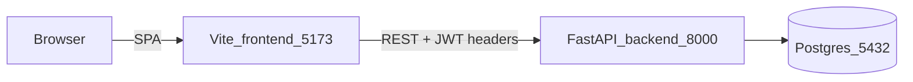
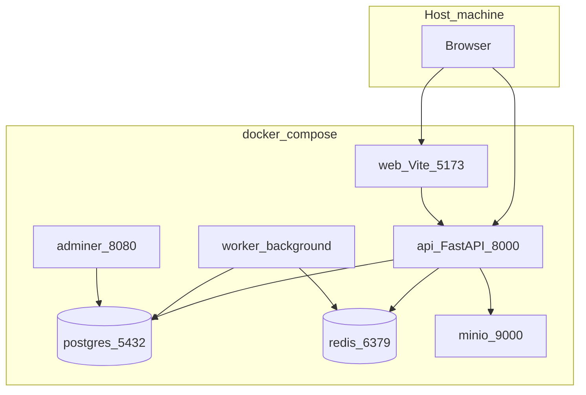
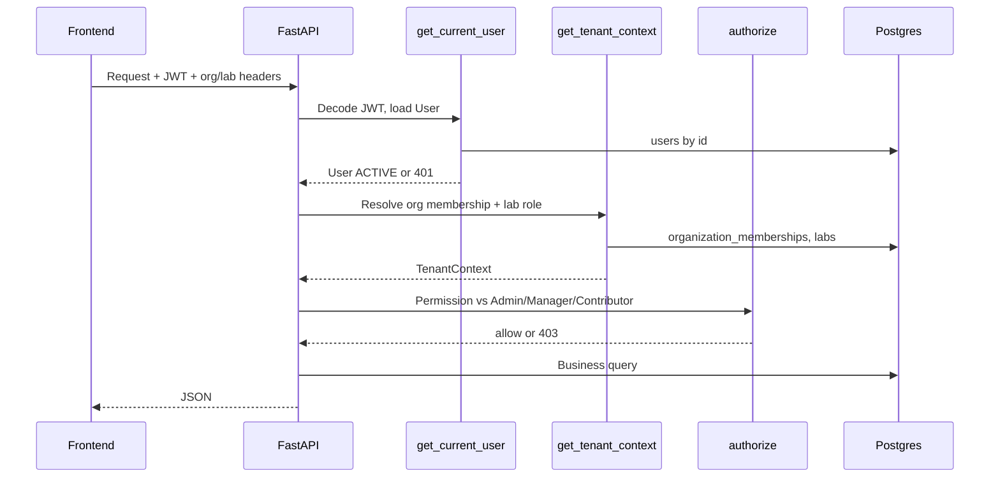
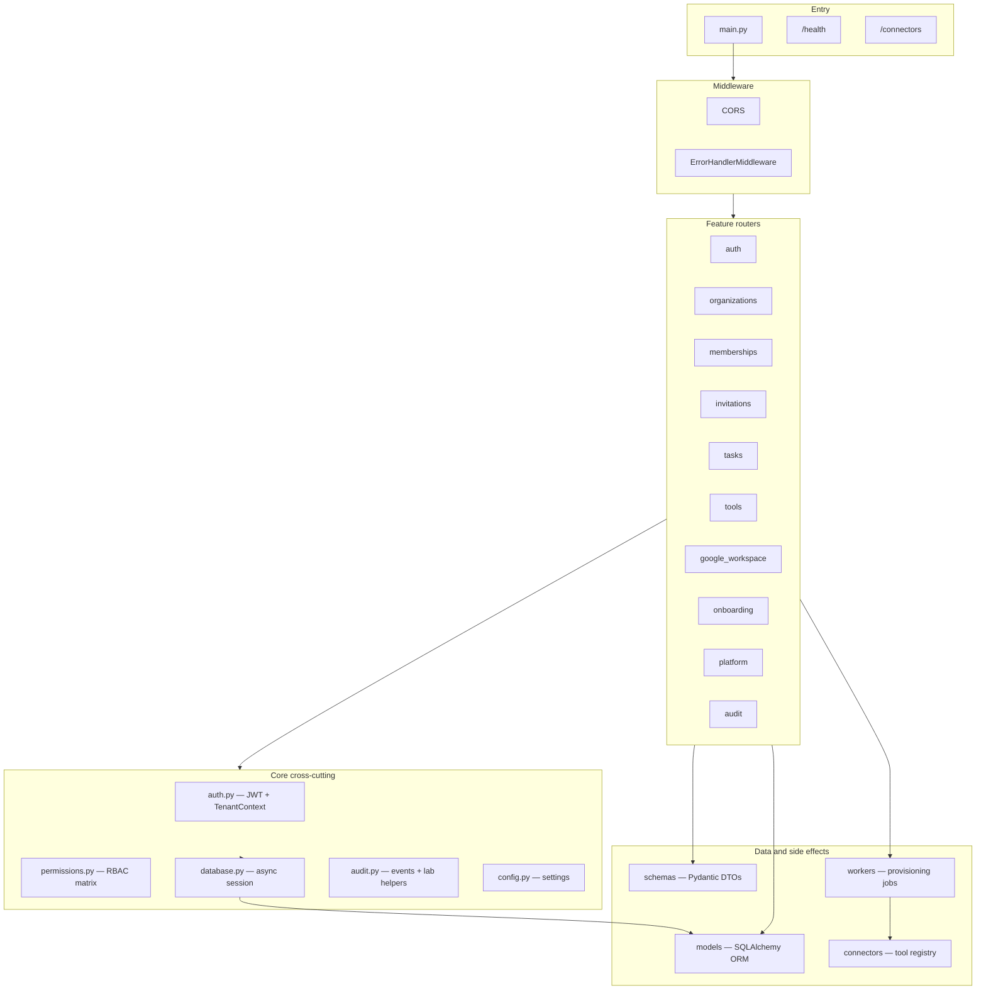
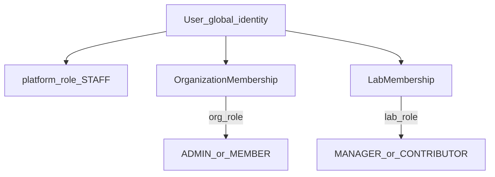
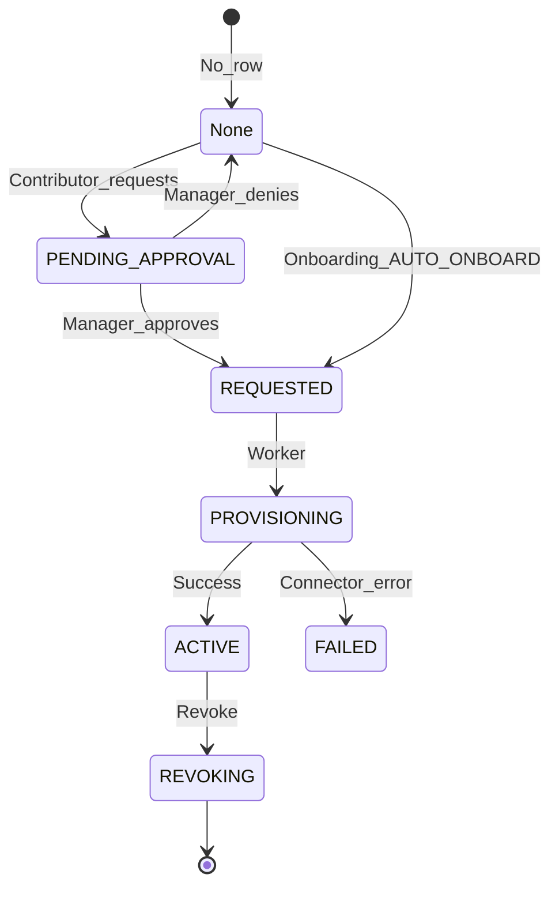
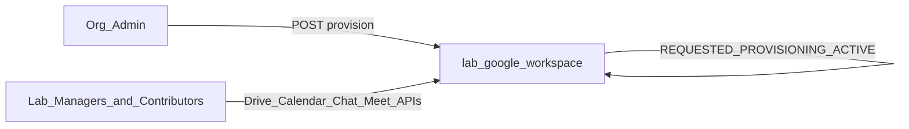
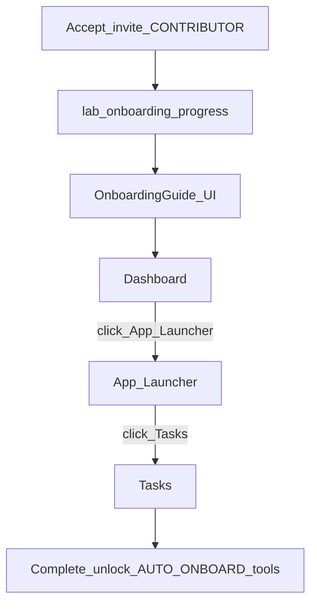

# Architecture

System architecture for the Corvinus Labs Multi-Tenant Lab Operations Portal as implemented in this repository.

Related docs: [PRD.md](PRD.md) · [DESIGN.md](DESIGN.md) · [SCHEMA.md](SCHEMA.md) · [DEMO_SCRIPT.md](DEMO_SCRIPT.md)

---

## 1. Local hosting

Two supported ways to run locally.

### Dev mode (typical for demos)

```bash
make install && make setup-db   # once
make dev-api                   # terminal 1 → FastAPI :8000
make dev-web                   # terminal 2 → Vite :5173
```



| Service | URL |
|---------|-----|
| App | http://localhost:5173 |
| API / OpenAPI | http://localhost:8000/docs |
| Health | http://localhost:8000/health |

Demo auth is passwordless: `POST /auth/demo-login` with a seeded `user_id`.

### Docker Compose (full stack)

`docker compose up` starts Postgres, Redis, MinIO, Adminer, API, optional worker, and web.



Local demos usually use **in-process FastAPI BackgroundTasks** for tool and Google Workspace provisioning (no separate worker required).

---

## 2. Multi-tenant request path

Every org-scoped API call carries:

1. `Authorization: Bearer <JWT>` — global user identity  
2. `X-Organization-Id` — active tenant  
3. `X-Lab-Id` (optional) — lab context for lab-scoped RBAC and tool catalog  



**Invariants**

- Suspended users (`users.status != ACTIVE`) cannot authenticate.  
- Removed org membership cannot obtain `TenantContext`.  
- Resources with `organization_id` must match the header org (tenant isolation).  
- Non-admins must be members of `X-Lab-Id` when that header is set.

---

## 3. API architecture

The backend is a **modular monolith**: one FastAPI process (`backend/app/main.py`), feature routers per domain, shared core for auth/RBAC/errors, and a single Postgres database. OpenAPI is auto-generated at `/docs`.

### Layer breakdown



| Layer | Location | Responsibility |
|-------|----------|----------------|
| Entry | `app/main.py` | Wire middleware, mount routers, `/health`, `/connectors` |
| Middleware | `app/core/errors.py`, CORS in `main.py` | Uniform error JSON, request IDs, cross-origin for SPA |
| Routers | `app/modules/*/router.py` | HTTP handlers — one module per product domain |
| Core | `app/core/*` | Auth, tenant context, RBAC, DB session, audit writers |
| Models | `app/models/` | SQLAlchemy entities; Alembic migrations in `backend/alembic/` |
| Schemas | `app/schemas/` | Pydantic request/response types (`*Create`, `*Update`, `*Out`) |
| Connectors | `app/connectors/` | Research-tool adapter registry (CVAT, Isaac Sim, Protocol Tool) |
| Workers | `app/workers/` | Tool + Google Workspace provisioning (BackgroundTasks or Redis worker) |

### Handler pattern

Every org-scoped route follows the same pipeline:

1. **`ErrorHandlerMiddleware`** — assigns `request_id`; catches `APIError` → JSON error body  
2. **`get_current_user`** — `Authorization: Bearer <JWT>` → `User` (401 if missing, invalid, or suspended)  
3. **`get_tenant_context`** — `X-Organization-Id` + optional `X-Lab-Id` → `TenantContext`  
4. **`authorize(ctx, Permission.*)`** — effective role (Admin / Manager / Contributor) vs permission matrix  
5. **Handler** — SQLAlchemy queries, optional `write_audit`, return Pydantic `response_model`

Platform routes (`/platform/*`) call `authorize_platform(user, Permission.*)` for Staff-only operations instead of tenant RBAC.

**Public or unauthenticated routes:** `GET /health`, `GET /connectors`, `GET /auth/demo-users`, `POST /auth/demo-login`, `GET /invitations/{token}`.

### Endpoint map by module

Routers are mounted flat in `main.py` (no global `/api/v1` prefix). Paths below are representative; see `/docs` for the full contract.

| Tag | Path pattern | Auth | Purpose |
|-----|--------------|------|---------|
| `auth` | `/auth/demo-users`, `/auth/demo-login`, `/auth/me` | Mixed | Passwordless demo login; current user + org/lab memberships |
| `organizations` | `/organizations/{org_id}/*`, `/organizations/labs/{lab_id}` | Tenant | Org profile, settings, dashboard stats, lab CRUD |
| `memberships` | `/organizations/{org_id}/members*`, `.../labs/{lab_id}/members*` | Tenant + RBAC | Org roster, lab members, org/lab role updates |
| `invitations` | `/organizations/{org_id}/invitations`, `/invitations/{token}/*` | Tenant / public | Create & list invites; token preview + accept |
| `tasks` | `/organizations/{org_id}/tasks`, `/tasks/{task_id}/*` | Tenant + lab RBAC | Task CRUD, comments, attachments; optimistic lock on `version` |
| `tools` | `/organizations/{org_id}/tools*`, `/tools/{tool_id}/*` | Tenant + lab RBAC | Tool registry, lab catalog, access workflow, launch/session/health |
| `google-workspace` | `/organizations/{org_id}/labs/{lab_id}/google-workspace/*` | Tenant + RBAC | Provision lab workspace; mock Drive, Calendar, Chat, Meet APIs |
| `onboarding` | `/organizations/{org_id}/labs/{lab_id}/onboarding/*` | Tenant | Scavenger-hunt steps, complete, dismiss role-change notice |
| `platform` | `/platform/organizations`, `/platform/analytics` | Staff JWT | Create/deactivate orgs, platform-wide analytics |
| `audit` | `/organizations/{org_id}/audit-events`, `.../notifications` | Admin | Immutable audit log + user notifications |

Lab-scoped RBAC resolves the **effective role** from `X-Lab-Id` when set; Admin bypasses lab membership checks but still uses the org-level permission set (e.g. read-only on tasks).

### Async side effects

Routes that start provisioning enqueue **FastAPI `BackgroundTasks`** in local demo mode (or a Redis-backed worker in Docker Compose):

- **Tool access** — `REQUESTED` → `PROVISIONING` → `ACTIVE` / `FAILED` via `app/connectors/registry.py`
- **Google Workspace** — same state machine on `lab_google_workspace`

Launch, session, and health checks for research tools hit the connector registry synchronously (mock responses in this demo).

### Error contract

All handled failures return:

```json
{
  "error": {
    "code": "FORBIDDEN",
    "message": "Role Contributor lacks permission tools.grant",
    "requestId": "550e8400-e29b-41d4-a716-446655440000"
  }
}
```

| Code | HTTP | Typical cause |
|------|------|---------------|
| `UNAUTHORIZED` | 401 | Missing/invalid JWT, suspended user |
| `FORBIDDEN` | 403 | No org membership, wrong role, tenant mismatch |
| `NOT_FOUND` | 404 | Resource absent or outside active org |
| `CONFLICT` | 409 | Stale task `version`, invalid state transition |
| `INTERNAL_ERROR` | 500 | Unhandled exception (message included in demo) |

---

## 4. Role model



| Layer | Field | Values | Scope |
|-------|--------|--------|--------|
| Platform | `users.platform_role` | `STAFF` / null | Create/deactivate orgs, platform analytics — not grantable via org invites |
| Organization | `organization_memberships.org_role` | `ADMIN`, `MEMBER` | Settings, members, invites, tool registry, audit, GW provision |
| Lab | `lab_memberships.lab_role` | `MANAGER`, `CONTRIBUTOR` | Tasks CRUD, tool launch/grant, team view |

Same person can be **Manager in Lab A** and **Contributor in Lab B** (e.g. Dave). UI role badge and tool privileges follow the **active lab** (`X-Lab-Id`).

Managers in the active lab may **launch all org-registered research tools** without a `ToolAccess` row. Contributors follow per-lab `lab_tool_policies`.

---

## 5. Research tool access & provisioning



Connectors (CVAT, Isaac Sim, Protocol Tool) live under `backend/app/connectors/`. Launch/session/health go through the connector registry.

Lab policies (`lab_tool_policies.access_mode`):

- `AUTO_ONBOARD` — granted when Contributor finishes lab onboarding  
- `REQUEST` — Contributor must request; Manager approves  

---

## 6. Google Workspace (lab infrastructure)

Shared per lab — **not** per-user `ToolAccess`.



State machine mirrors tools: `REQUESTED` → `PROVISIONING` → `ACTIVE` (mock ~2–3s via BackgroundTasks). Members of other labs in the same org cannot read Lab B’s workspace.

---

## 7. Contributor onboarding (scavenger hunt)



Onboarding is first-login per lab. Role changes later show a banner (`role_change_notice`); they do **not** re-trigger onboarding.

---

## 8. Frontend structure

- React + Vite + TanStack Query  
- [`AuthContext`](../frontend/src/context/AuthContext.tsx) — token, orgId, labId  
- [`AppShell`](../frontend/src/components/layout/AppShell.tsx) — nav by effective role, onboarding guide, role-change banner  
- Org/lab switcher updates localStorage + API headers  

## 9. Backend module map

See [§3 API architecture](#3-api-architecture) for layers, handler pipeline, endpoint map, and error contract.

| Module | Responsibility |
|--------|----------------|
| `auth` | Demo login, `/auth/me` |
| `organizations` | Labs, dashboard stats, settings |
| `memberships` | Org roster, lab members, role updates |
| `invitations` | Create/accept invites |
| `tasks` | CRUD, transitions, optimistic locking |
| `tools` | Registry, catalog, access, launch |
| `google_workspace` | Provision + mock Drive/Calendar/Chat/Meet |
| `onboarding` | Scavenger steps + complete |
| `platform` | Staff org create (requires admin invite email) |
| `audit` | Audit events + notifications |
| `workers` | Tool + GW provisioning jobs |
