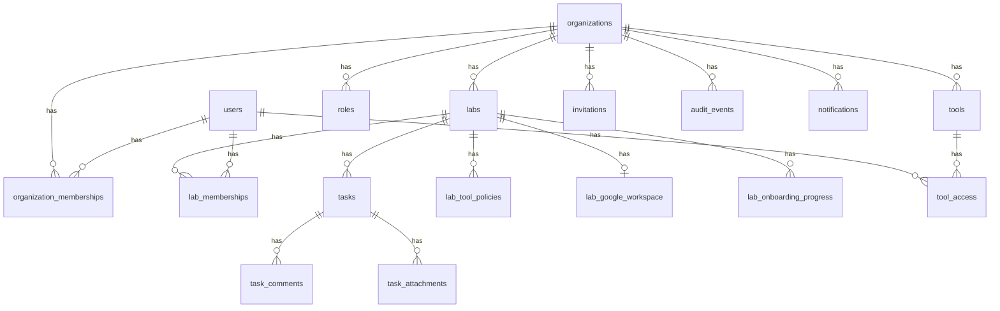

# Relational database schema

Postgres schema for the Corvinus Labs portal. Source of truth: SQLAlchemy models in [`backend/app/models/__init__.py`](../backend/app/models/__init__.py) and Alembic migrations `001`–`005`.

Visual ERD (may lag newer tables): [erd.png](erd.png)

---

## Entity relationship (logical)

---

## Tables

### Identity & tenancy

| Table | Purpose | Key columns |
|-------|---------|-------------|
| `users` | Global identity | `id`, `email` UNIQUE, `status` (`ACTIVE`/`SUSPENDED`), `platform_role` (`STAFF` or null) |
| `organizations` | Tenant | `id`, `slug` UNIQUE, `status` (`ACTIVE`/`DISABLED`) |
| `roles` | Legacy named roles per org | `organization_id`, `name` (Admin/Manager/Contributor) — still referenced by FKs; effective auth uses `org_role` / `lab_role` |
| `organization_memberships` | User ↔ org | UNIQUE(`user_id`,`organization_id`), `org_role` (`ADMIN`/`MEMBER`), `status` |
| `labs` | Lab within org | `organization_id`, `name`, `archived` |
| `lab_memberships` | User ↔ lab | UNIQUE(`user_id`,`lab_id`), `lab_role` (`MANAGER`/`CONTRIBUTOR`), `status`, `role_change_notice` |
| `organization_settings` | Org prefs | UNIQUE(`organization_id`), timezone/date formats |

### Invitations & onboarding

| Table | Purpose | Key columns |
|-------|---------|-------------|
| `invitations` | Email invite tokens | `token` UNIQUE, `email`, `org_role`, `lab_role`, `lab_id`, `status`, `expires_at` |
| `lab_onboarding_progress` | Contributor scavenger hunt | UNIQUE(`user_id`,`lab_id`), `steps_completed` JSON, `completed_at` |
| `lab_tool_policies` | Per-lab default tool access | UNIQUE(`lab_id`,`tool_type`), `access_mode` (`AUTO_ONBOARD`/`REQUEST`) |

### Work & tools

| Table | Purpose | Key columns |
|-------|---------|-------------|
| `tasks` | Lab kanban items | `organization_id`, `lab_id`, `status`, `priority`, `assignee_id`, `version` (optimistic lock) |
| `task_comments` | Comments | `task_id`, `author_id`, `content` |
| `task_attachments` | Files metadata | `task_id`, `file_url`, … |
| `tools` | Org tool registry | `organization_id`, `type` (`cvat`/`isaac_sim`/`protocol_tool`), `connector_config` JSON, `status` |
| `tool_access` | Per-user tool grant | UNIQUE(`tool_id`,`user_id`), `provisioning_status`, `granted_by_id`, `failure_reason` |
| `lab_google_workspace` | Shared GW per lab | UNIQUE(`lab_id`), Drive/Calendar/Chat/Meet URLs, `provisioning_status` |

### Audit & notifications

| Table | Purpose | Key columns |
|-------|---------|-------------|
| `audit_events` | Immutable action log | `organization_id`, `actor_user_id`, `action`, `entity_type`, `entity_id`, `metadata` JSON |
| `notifications` | In-app notices | `user_id`, `type`, `title`, `message`, `is_read` |

---

## Role & status enums (demo-critical)

**Org role:** `ADMIN` | `MEMBER`  
**Lab role:** `MANAGER` | `CONTRIBUTOR`  
**Membership status:** `INVITED` | `ACTIVE` | `REMOVED`  
**User status:** `ACTIVE` | `SUSPENDED`  
**Task status workflow:** `BACKLOG` → `TODO` → `IN_PROGRESS` ↔ `BLOCKED` → `DONE`  
**Tool / GW provisioning:** `REQUESTED` | `PROVISIONING` | `ACTIVE` | `FAILED` | `PENDING_APPROVAL` | `REVOKING`

---

## Important foreign keys & constraints

- `organization_memberships.user_id` → `users.id`  
- `organization_memberships.organization_id` → `organizations.id`  
- `lab_memberships.lab_id` → `labs.id` (lab’s `organization_id` must match org membership in app logic)  
- `tasks.lab_id` → `labs.id` and `tasks.organization_id` → `organizations.id` (both set; must agree)  
- `tool_access.tool_id` → `tools.id`  
- `invitations.lab_id` → `labs.id` (nullable for org-admin-only invites from Staff create-org)  
- `lab_google_workspace.lab_id` UNIQUE — one workspace row per lab  

---

## Migrations

| Revision | Change |
|----------|--------|
| `001` | Initial ERD tables |
| `002` | `users.platform_role` |
| `003` | `org_role`, `lab_role` on memberships/invites; `lab_google_workspace` |
| `004` | `lab_tool_policies`, `lab_onboarding_progress`, `role_change_notice` |
| `005` | `lab_onboarding_progress.steps_completed` JSON |

Apply with `alembic upgrade head` or `make demo-reset`.

---

## Seed labs & policies (Robotics)

| Lab | AUTO_ONBOARD | REQUEST |
|-----|--------------|---------|
| Simulation | `isaac_sim`, `protocol_tool` | `cvat` |
| Perception | `cvat` | `isaac_sim`, `protocol_tool` |
