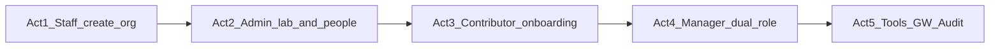

# Video demo script (≈12–15 minutes)

Filmable product walkthrough: greenfield org creation, then full feature tour on seeded **Corvinus Robotics**.

Related: [DEMO_SCRIPT.md](DEMO_SCRIPT.md) (short live rehearsal) · [ARCHITECTURE.md](ARCHITECTURE.md) · [SCHEMA.md](SCHEMA.md) · [PRD.md](PRD.md)

---

## Prep (before you hit record)

1. Terminal: `make demo-reset` → `make dev-api` → `make dev-web`.
2. Browser: http://localhost:5173 — zoom **110–125%**, hide bookmarks bar.
3. Optional: http://localhost:8000/docs in a second window (10s API flash only).
4. Keep the API terminal **off-camera** for `[INVITE EMAIL]` / invite links if the UI does not copy them.
5. Rehearse persona switches once: Jordan → new Admin (invite) → Eve → Dave → Marcus.

**Opening VO (say once early):**  
> “This is a multi-tenant lab operations portal. Admin is org-scoped; Manager and Contributor are lab-scoped. One person can hold different roles in different labs — and across orgs.”

**Recording tip:** One take per Act; splice in post. Freeze ~1s on invite links, ACTIVE badges, and Launch vs Request buttons.

---

## Act 1 — Open an organization (~2 min)

**Persona:** Jordan Staff

| # | Click path | Suggested VO |
|---|------------|--------------|
| 1 | Land on **Login** — scroll demo identities | “Demo login selects identities. Staff is separate from organization roles.” |
| 2 | Click **Jordan Staff** | “Staff creates tenants; they don’t join labs as members.” |
| 3 | **Platform Analytics** — hover Active Orgs / Users / Tools stats | “Cross-org health: organizations, users, tools, provisioning success.” |
| 4 | **Create Organization** — Name: `Northwind Labs` · Admin email: `admin.north@corvinus.dev` → **Create & Invite Admin** | “Creating an org requires inviting at least one Admin — so someone owns the tenant on day one.” |
| 5 | Pause on success message + **admin invite link** | “Accepting this link confirms the Admin role for that organization.” |

**Do not:** Deactivate organizations on camera.

**If the invite link is only in the API log:** Paste it into the address bar on camera and say “mock invite delivery for the demo.”

---

## Act 2 — Lab + people (~3 min)

### Path A — Greenfield (preferred)

**Persona:** New Admin via invite from Act 1

| # | Click path | Suggested VO |
|---|------------|--------------|
| 1 | Logout (or use a private window) → open admin invite URL | “We’re accepting the Staff-issued Admin invite.” |
| 2 | Accept Invitation — enter full name → Accept | “Name is only needed for a brand-new user account.” |
| 3 | Confirm org context is **Northwind Labs** (or whatever you created) | “Empty tenant — Admin can stand up labs and members.” |
| 4 | Sidebar **Labs** → create lab `Wet Lab` (optional manager invite email) → Create | “Labs are the operational unit; Managers and Contributors attach here.” |
| 5 | Sidebar **Members** → invite `wetlab.contrib@corvinus.dev` to **Wet Lab** as **Contributor** | “Invites always carry org, lab, and role.” |
| 6 | Open the invite accept page (link from UI or log) — freeze on org / lab / role + confirmation copy | “Accepting confirms this is the right role so onboarding matches.” |

### Path B — Cut to seeded tenant (if greenfield feels empty)

After Act 1’s create-org shot:

> VO: “Existing tenant Corvinus Robotics already has labs and tools — we’ll use Marcus for the rest of the product tour.”

Login as **Marcus Admin**.

### Marcus Admin (always film these)

**Persona:** Marcus Admin @ Corvinus Robotics

| # | Click path | Suggested VO |
|---|------------|--------------|
| 1 | Login as **Marcus Admin** | “Org Admin — oversight across every lab.” |
| 2 | **Dashboard** — stats cards | “Org-wide visibility: labs, members, open tasks, workspaces.” |
| 3 | **Labs** — list Perception / Simulation; optionally edit description | “Admin manages lab lifecycle and Google Workspace provisioning.” |
| 4 | **Members** — roster; expand **Manage Labs** on one user | “Same person can be Manager in one lab and Contributor in another.” |
| 5 | Invite someone to **Simulation Lab** as **Contributor** (show link) | “We’ll pick this up with Eve’s onboarding next.” |

**Say (don’t click-fail):**  
> “Admins don’t create or edit tasks — that’s operational work for Managers and Contributors. Admin stays an oversight role.”

---

## Act 3 — Contributor journey (~3 min)

**Persona:** Eve Nguyen (Contributor @ Perception onboarded; **Simulation** pending after `demo-reset`)

| # | Click path | Suggested VO |
|---|------------|--------------|
| 1 | Logout → login **Eve Nguyen** → switcher to **Simulation Lab** if needed | “First time in Simulation starts lab-specific onboarding.” |
| 2 | Floating guide — **Continue** on welcome | “Scavenger hunt — we learn by going to the real screens.” |
| 3 | When prompted, click highlighted sidebar **App Launcher** | “The guide advances when you navigate.” |
| 4 | On App Launcher card — **Continue** | “Research tools will unlock after we finish.” |
| 5 | Click highlighted **Tasks** → board explanation — **Continue** | “Task board is where lab work lives.” |
| 6 | Checklist step → **Finish onboarding & unlock tools** | “Completing onboarding provisions this lab’s starter tools.” |
| 7 | **App Launcher** → Research Tools: **Launch** Isaac Sim and/or Protocol Tool | “Simulation lab auto-grants Isaac Sim and Protocol Tool.” |
| 8 | On **CVAT** — show **Request Access** (not Launch) | “CVAT still needs manager approval for this lab.” |
| 9 | **Tasks** → open a task → **Edit** → change status along a valid path (e.g. BACKLOG→TODO) → **Save** | “Read-only by default; Edit then Save — one audit event for the update.” |

**One-liner:**  
> “Starter tools come from lab onboarding policies; restricted tools require a manager request.”

---

## Act 4 — Dual lab roles (~2 min)

**Persona:** Dave Okonkwo

| # | Click path | Suggested VO |
|---|------------|--------------|
| 1 | Logout → login **Dave Okonkwo** | “Dave is Manager in Perception and Contributor in Simulation.” |
| 2 | Org/lab switcher → **Perception Lab** — confirm badge **Manager** | “Active lab drives the role badge and permissions.” |
| 3 | **App Launcher** — all tools show **Launch** | “Managers of this lab can launch every registered research tool.” |
| 4 | **Dashboard** — if Eve’s Isaac request is pending → **Approve** | “Managers approve contributor tool requests.” |
| 5 | Switcher → **Simulation Lab** — badge **Contributor** | “Same user, different lab.” |
| 6 | **App Launcher** — CVAT shows **Request Access**, not Launch | “Privileges follow the lab you’re looking at — not a flat org role.” |
| 7 | Optional: switch org to **Corvinus Biologics** — badge **Admin** | “Dave is also Admin in a second organization — multi-tenant membership.” |

### Optional 20s — Multi-org (Dave)

| # | Click path | Suggested VO |
|---|------------|--------------|
| 1 | Org switcher: Robotics → Biologics | “Users can belong to multiple organizations with independent roles.” |

---

## Act 5 — Integrations, registry, audit (~3 min)

**Persona:** Marcus Admin

| # | Click path | Suggested VO |
|---|------------|--------------|
| 1 | **Labs** → pick a lab → **Provision Workspace** (if not ACTIVE) | “Google Workspace is provisioned once per lab — shared infrastructure.” |
| 2 | Wait ~3 seconds — status **REQUESTED → PROVISIONING → ACTIVE** | “Async mock provisioning — same pattern as tool connectors.” |
| 3 | **App Launcher** → **Google Workspace** tab → click Drive, Calendar, Chat, Meet | “Every lab member uses these once ACTIVE — no per-user tool grant.” |
| 4 | Sidebar **Tools** → register e.g. name `Demo Annotator`, category annotation, URL `https://example.com/annotator` → Create | “Admins register tools without changing launcher code.” |
| 5 | **Audit Log** — scroll recent events | “Proof trail: invites, onboarding, tool access, workspace provision, tool.created.” |
| 6 | Hold on final frame | “We’ve covered the PRD areas — users and onboarding, tasks and roles, Google ecosystem, and the app launcher — with tenant isolation and auditability.” |

---

## Feature checklist (hit every box on camera)

- [ ] Staff create org + admin invite  
- [ ] Admin create/manage lab  
- [ ] Invite with lab + role; accept flow  
- [ ] Contributor scavenger-hunt onboarding  
- [ ] Lab tool policies (Launch vs Request)  
- [ ] Manager approve tool request  
- [ ] Dual lab role switch (Dave)  
- [ ] Tasks + Edit/Save (Contributor or Manager)  
- [ ] Google Workspace provision + use  
- [ ] Register research tool  
- [ ] Audit log  

---

## Avoid on camera

- Creating or editing tasks as **Admin** (correctly forbidden — explain instead).
- Cold-provisioning Google Workspace without narrating the ~3s wait.
- Deactivating orgs.
- Racing clicks; keep cursor large and pauses intentional.
- Long code dives — point to docs/ARCHITECTURE.md or SCHEMA.md only if needed in a cutaway.

---

## Suggested edit order (post)

1. Act 1 (Staff)  
2. Act 2 Path A (greenfield) **or** Path B bridge VO + Marcus Members/Labs  
3. Act 3 (Eve)  
4. Act 4 (Dave)  
5. Act 5 (Marcus GW + Tools + Audit)  
6. Title + end card with repo / docs links  

**Rough runtime:** Act1 2:00 · Act2 3:00 · Act3 3:00 · Act4 2:00 · Act5 3:00 · buffer 1–2:00 → **~12–15 min**.
